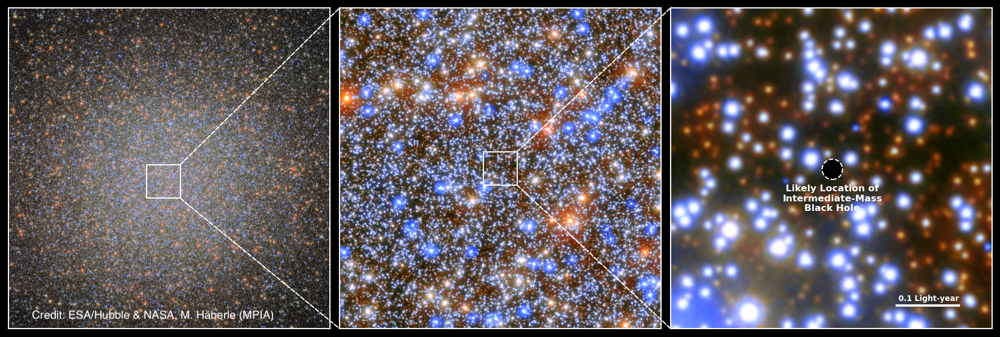

# The oMEGACat Homepage

## General Motivation and Project Overview

Omega Centauri ($omega; Cen, NGC 5139)	is the most massive globular cluster of	the Milky Way and is believed to be the stripped nucleus of an accreted dwarf galaxy. This makes it a unique laboratory to study both a witness of the merger history of the Milky Way	and a nearby low-mass galactic nucleus.

In the oMEGACat	project, led by	Nadine Neumayer	(MPIA) and Anil	Seth (Univ. of Utah) we	aim to disentangle its dynamics and its formation history by creating the largest	dataset	ever assembled for a globular cluster. Our data consists of two main catalogs: An extensive MUSE effort of more than 100 individual pointings providing spectra for more than 300,000 stars and giving us metallicities and line-of-sight velocities, and a Hubble Space Telescope-based catalog containing around 1.4 million individual proper motion measurements and precise 7-band	photometry.

The combined catalogs are already enabling a wide range of science projects, including	studies	of the cluster's metallicity distribution, its multiple populations, its age-metallicity relation, and its central intermediate-mass black hole.

## Data Access
The main catalogs created in this project are publicly available:

**MUSE Spectroscopic Catalog:**

Download from [IOP](https://iopscience.iop.org/article/10.3847/1538-4357/acf5db#apjacf5dbt3)

**HST Astro-Photometric Catalog:**

Download from [Zenodo](https://zenodo.org/doi/10.5281/zenodo.11104045)

## Publications

* **oMEGACat. I. MUSE Spectroscopy of 300,000 Stars within the Half-light Radius of &omega; Centauri** Nitschai, Neumayer, Clontz et al. ApJ, 958, 8 (2023) [ADS-Link](https://ui.adsabs.harvard.edu/abs/2023ApJ...
958....8N/abstract)
* **Fast-moving stars around an intermediate-mass black hole in &omega; Centauri** Häberle, Neumayer, Seth et al. Nature, 631, 285 (2024) [ADS-Link](https://ui.adsabs.harvard.edu/abs/2024Natur.631..285H/abstract)
* **oMEGACat. II. Photometry and Proper Motions for 1.4 Million Stars in Omega Centauri and Its Rotation in the Plane of the Sky** Häberle, Neumayer, Bellini et al. ApJ, 970, 192 (2024)  [ADS-Link](https://ui.adsabs.harvard.edu/abs/2024ApJ...970..192H/abstract)
* **oMEGACat. III. Multiband Photometry and Metallicities Reveal Spatially Well-mixed Populations within &omega; Centauri's Half-light Radius** Nitschai, Neumayer, Häberle et al. ApJ, 970, 152 (2024)  [ADS-Link](https://ui.adsabs.harvard.edu/abs/2024ApJ...970..152N/abstract)

